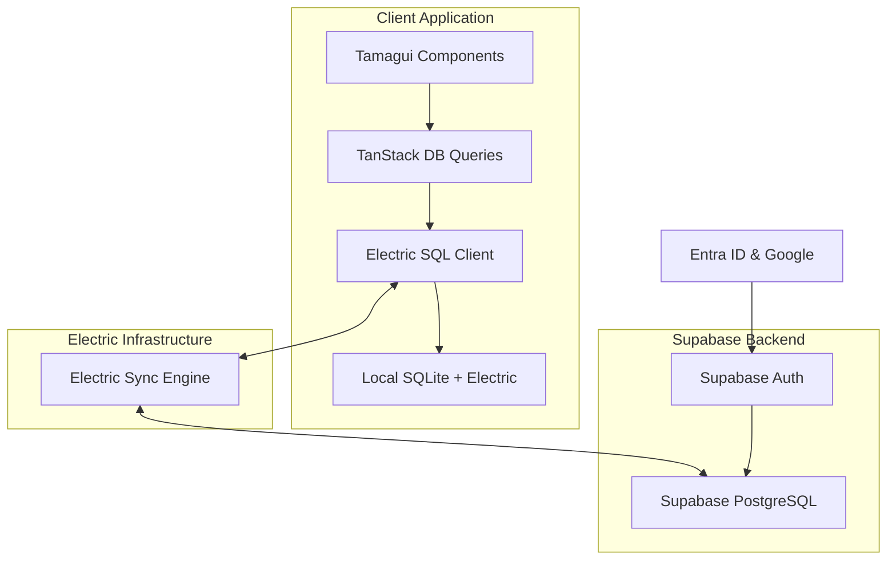

# Flight Timetable Design Document

## Overview

The Flight Timetable System is a real-time collaborative application that demonstrates modern local-first architecture using Electric SQL, TanStack DB, Drizzle ORM, and Supabase. The system provides a drag-and-drop interface for flight scheduling with live collaborative updates, built with Tamagui for cross-platform compatibility.

The architecture follows a local-first approach where all operations happen locally first, then sync to the cloud, ensuring fast user interactions and offline capability.

## Architecture

### High-Level Architecture



### Technology Stack

- **Frontend**: React with Tamagui for cross-platform UI
- **Local Database**: TanStack DB with Electric SQL adapter
- **Database Engine**: SQLite (local) synced with PostgreSQL (Supabase)
- **Sync Layer**: Electric SQL for real-time bidirectional sync
- **Schema Management**: Drizzle ORM for type-safe database operations
- **Backend**: Supabase for authentication and cloud PostgreSQL
- **Authentication**: Entra ID and Google via Supabase Auth

## Components and Interfaces

### Core Components

1. **TimetableGrid**: Main grid component displaying time slots and plane columns
2. **FlightCard**: Individual flight representation with drag capabilities
3. **FlightCreator**: Modal/form for creating new flights
4. **AuthProvider**: Handles Entra ID and Google authentication flows
5. **DatabaseProvider**: Configures TanStack DB with Electric SQL adapter

### Data Flow (TanStack DB Electric Collection Integration)

From TanStack DB Electric Collection documentation:

```typescript
import { Database } from '@tanstack/db'
import { ElectricCollection } from '@tanstack/db/electric'
import { electric } from './electric'

// Create database with Electric SQL client
const db = new Database({
  electric: electric, // Electric SQL client instance
})

// Define collections using Electric Collection
const flightsCollection = new ElectricCollection({
  db,
  table: 'flights',
  shape: {
    include: {
      plane: true,
      pilot: true,
    }
  }
})

// Reactive queries with real-time sync
const useFlights = () => {
  return flightsCollection.useQuery({
    where: { planeId: { in: selectedPlaneIds } },
    orderBy: { timeSlot: 'asc' }
  })
}

// Mutations with optimistic updates
const createFlight = (flightData) => {
  return flightsCollection.create(flightData)
}

const updateFlightPosition = (flightId, newTimeSlot) => {
  return flightsCollection.update({
    where: { id: flightId },
    data: { timeSlot: newTimeSlot }
  })
}
```

**Integration Pattern**:
1. TanStack DB uses Electric SQL client for sync operations
2. ElectricCollection provides reactive queries with real-time updates
3. Mutations automatically sync via Electric SQL to Supabase
4. Shape subscriptions ensure related data (planes, pilots) stay in sync
5. Optimistic updates provide immediate UI feedback

### Real-time Collaboration

- Electric SQL provides automatic conflict resolution
- Optimistic updates for immediate UI feedback
- Real-time cursors/indicators during drag operations
- Operational transforms for concurrent edits

## Data Models

### Database Schema (Drizzle - Supabase Only)

```typescript
// planes table
export const planes = pgTable('planes', {
  id: uuid('id').primaryKey().defaultRandom(),
  name: varchar('name', { length: 100 }).notNull(),
  createdAt: timestamp('created_at').defaultNow(),
});

// pilots table
export const pilots = pgTable('pilots', {
  id: uuid('id').primaryKey().defaultRandom(),
  name: varchar('name', { length: 100 }).notNull(),
  createdAt: timestamp('created_at').defaultNow(),
});

// flights table
export const flights = pgTable('flights', {
  id: uuid('id').primaryKey().defaultRandom(),
  planeId: uuid('plane_id').references(() => planes.id).notNull(),
  pilotId: uuid('pilot_id').references(() => pilots.id).notNull(),
  flightDate: date('flight_date').notNull(), // Date of the flight
  timeSlot: integer('time_slot').notNull(), // Hour of day (7-18 for 7am-6pm)
  flightType: varchar('flight_type', { length: 20 }).notNull(), // 'departure' | 'arrival'
  // Drag state fields for real-time collaboration
  isDragging: boolean('is_dragging').default(false),
  dragUserId: varchar('drag_user_id', { length: 100 }),
  dragPlaneId: uuid('drag_plane_id').references(() => planes.id),
  dragTimeSlot: integer('drag_time_slot'),
  createdAt: timestamp('created_at').defaultNow(),
  updatedAt: timestamp('updated_at').defaultNow(),
});
```

### TypeScript Interfaces

```typescript
interface Flight {
  id: string;
  planeId: string;
  pilotId: string;
  flightDate: Date;
  timeSlot: number; // Hour of day (7-18)
  flightType: 'departure' | 'arrival';
  // Drag state for real-time collaboration
  isDragging: boolean;
  dragUserId?: string;
  dragPlaneId?: string;
  dragTimeSlot?: number;
  plane?: Plane;
  pilot?: Pilot;
}

interface Plane {
  id: string;
  name: string;
}

interface Pilot {
  id: string;
  name: string;
}
```

## Correctness Properties

*A property is a characteristic or behavior that should hold true across all valid executions of a system-essentially, a formal statement about what the system should do. Properties serve as the bridge between human-readable specifications and machine-verifiable correctness guarantees.*

### Property Reflection

After analyzing all acceptance criteria, several properties can be consolidated:
- Authentication properties (1.2) can be combined with session management
- UI rendering properties (2.1, 2.3) can be unified as reactive layout updates
- Flight creation and persistence properties (3.2, 3.3, 3.5) can be combined into comprehensive creation workflow
- Drag operation properties (4.2, 4.3, 4.4, 4.5) can be unified as drag validation and persistence
- Real-time collaboration properties (5.1-5.5) can be consolidated into collaborative state synchronization
- Visual indicator properties (6.1, 6.2, 6.3, 6.4) can be combined into comprehensive rendering validation

### Core Properties

**Property 1: Authentication session management**
*For any* successful authentication event, the system should create or update a valid user session in Supabase and maintain session state consistency
**Validates: Requirements 1.2**

**Property 2: Reactive timetable layout**
*For any* change in plane data (addition, removal, modification), the timetable should immediately update its column layout to reflect the current plane set
**Validates: Requirements 2.1, 2.3**

**Property 3: Flight creation validation and persistence**
*For any* flight creation attempt, if all required fields (departure time, plane, pilot) are provided, the flight should be persisted locally via TanStack DB and synchronized to Supabase
**Validates: Requirements 3.2, 3.3, 3.5**

**Property 4: Drag operation validation**
*For any* flight drag operation, moves within the same plane column to empty slots should succeed and update departure time, while moves to occupied slots or different plane columns should be rejected
**Validates: Requirements 4.2, 4.3, 4.5**

**Property 5: Drag persistence and synchronization**
*For any* successful flight move, the change should be persisted locally and synchronized across all connected clients immediately
**Validates: Requirements 4.4, 5.3**

**Property 6: Real-time collaborative state**
*For any* drag operation by one user, all other connected users should see the drag state, position updates, and final result in real-time
**Validates: Requirements 5.1, 5.2, 5.4**

**Property 7: Data consistency across clients**
*For any* concurrent operations across multiple clients, the system should maintain eventual consistency and resolve conflicts deterministically
**Validates: Requirements 5.5**

**Property 8: Flight visual indicators**
*For any* flight rendering, the flight should display appropriate departure/arrival visual indicators that remain consistent with the flight type and update immediately when data changes
**Validates: Requirements 6.1, 6.2, 6.3, 6.4**

**Property 9: Local database operations**
*For any* local database operation, the system should use TanStack DB for immediate local updates while Drizzle manages Supabase schema and migrations
**Validates: Requirements 7.2, 8.2**

**Property 10: Offline-online synchronization**
*For any* network state change, the system should continue operating locally when offline and synchronize all pending changes when connectivity is restored
**Validates: Requirements 7.3, 7.5**

**Property 11: Cross-platform component usage**
*For any* UI component rendering, the system should use Tamagui components and handle events through Tamagui systems for cross-platform compatibility
**Validates: Requirements 9.1, 9.2, 9.3**

## Error Handling

### Client-Side Error Handling

1. **Network Errors**: Graceful degradation to offline mode with user notification
2. **Authentication Errors**: Clear error messages with retry mechanisms
3. **Validation Errors**: Real-time form validation with helpful error messages
4. **Drag Operation Errors**: Visual feedback for invalid moves with smooth reversion
5. **Sync Conflicts**: Automatic conflict resolution with user notification for manual resolution cases

### Data Integrity

1. **Optimistic Updates**: All UI updates happen immediately with rollback on failure
2. **Conflict Resolution**: Electric SQL handles most conflicts automatically
3. **Schema Validation**: Drizzle ensures Supabase schema consistency, TanStack DB handles local validation
4. **Referential Integrity**: Foreign key constraints prevent orphaned records

